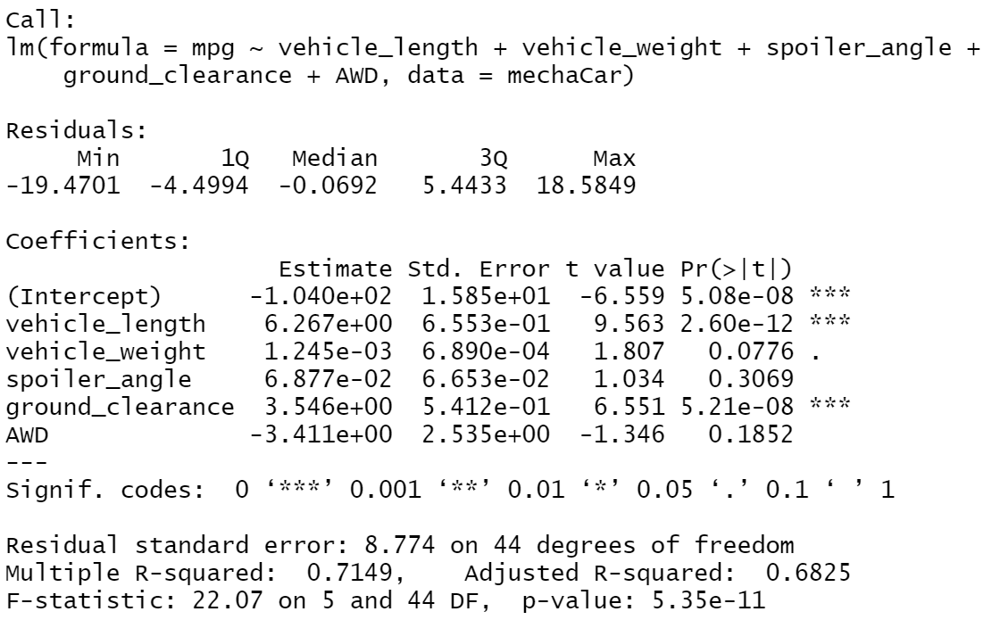
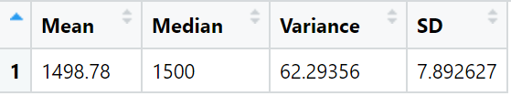
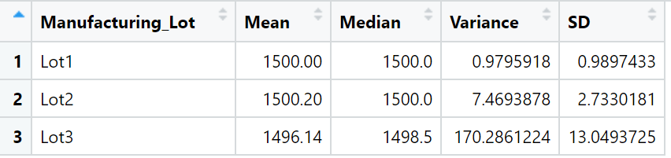
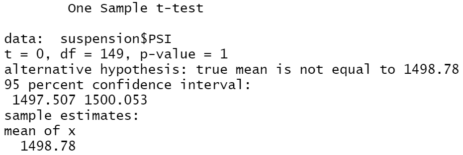
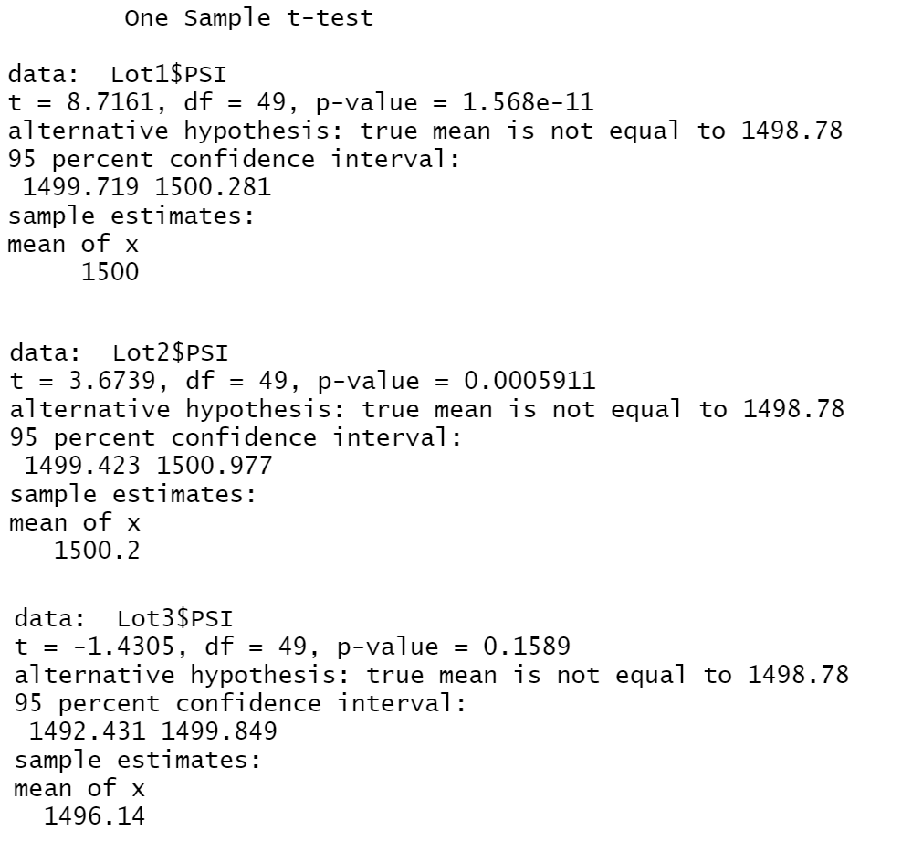

# MechaCar Statistical Analysis

## Linear Regression to Predict MPG

Among our independent variables the t value tells us that car length and ground clearance are providing a non-random amount of variance to the MPG. The larger the t value, the more likely that the coefficient is non-zero.

The slope of this regression model is not zero. In order for the slope of this model to be zero, either the dependent or independent variable would have to be static. Meaning that as one value changed, the other axis did not. For example, if the MPG was always 35 as the length or ground clearance changed, that would create a zero slope.

I don't think this model is accurately predicting the MPG for MechaCar prototypes, as the residual standard error is more than 8 MPG. Meaning the predicted MPG is from -8 to +8 off of the actual MPG.

## Summary Statistics on Suspension Coils

Looking at the suspension coil results, we can see that overall the variance is well within the limit of 100 PSI. However, when we look at individual lots, we see that Lot 3 is actually over the variance limit by quite a bit.

## T-Tests on Suspension Coils

Looking at our t-test data for each lot, we have a very high confidence that the mean for Lots 1 and 2 is statistically the same as the population mean of 1500. As both of those p-values are less than 1%. Conversely, the higher p-value for Lot 3 says that it is more likely there is a statistical difference between its mean and the population mean.

## Study Design: MechaCar vs Competition

Consumers are looking for the best value when buying a car. A lot of factors play into that decision, but two of key concern are the cost and fuel efficiency. We can compare MechaCar against the current top 10 selling car models that use the same fuel (i.e. electric or standard gasoline). This will show us how MechaCar's cost vs fuel efficiency compares to other top car brands, and if there is any correlation between cost and fuel efficiency.

The data needed for this analysis will be car make, model, cost, and overall MPG. We can then run a regression test on cost and MPG across the car models to find out how much MPG is gained as the cost of the vehicle rises.

Our null hypothesis for this analyis is "There is no predictable correlation between cost and fuel efficiency".

